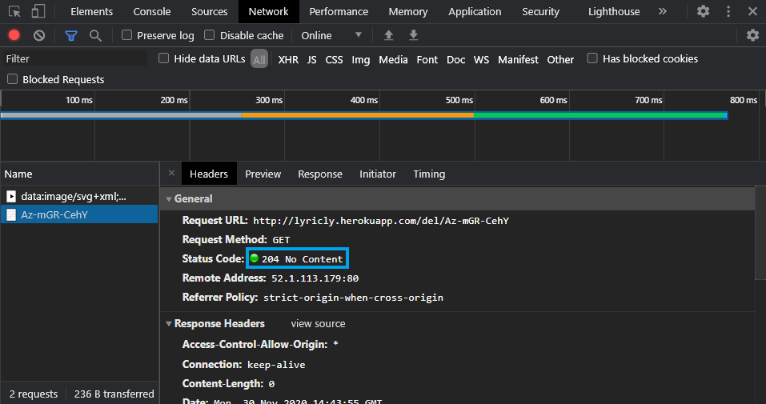

# lyricly-api

>This api allows you to get any youtube video in audio format.

#### Requesting a song/video will get you a JSON response with following data (id, title, image, duration)
##### route: address/input

#### Use the id property to play the song
##### route: address/play/id

#### There are two types of deletion, 1. Automatic deletion with a timer, 2. Instant deletion using route
##### route: address/del/id for instant deletion

